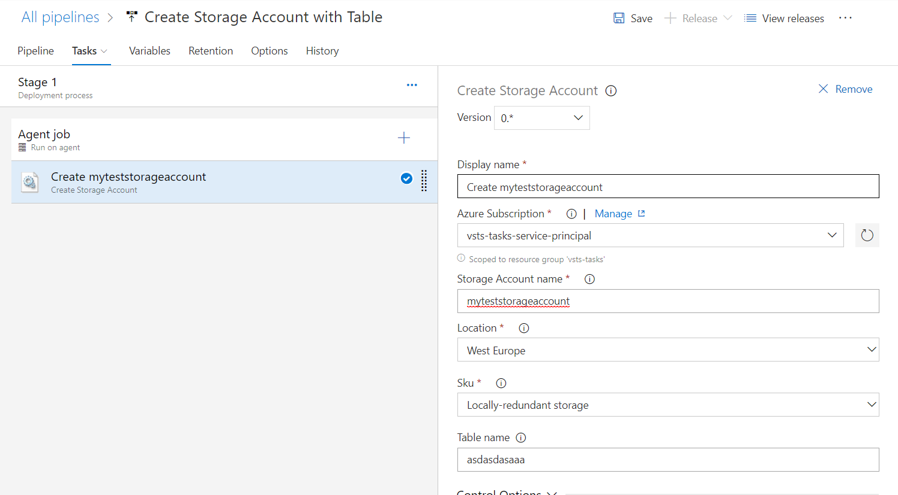

# vsts-tasks

I want to achieve here a few tasks which let me to create and manage a Storage Account on an Azure DevOps' Release Pipeline.

### 1. Create Storage Account
Provide a possibility to create storage account and a single table on a Release pipeline, before application deployment.

#### How to use
1. Install the task in your Azure Devops account by navigating to the marketplace and click install. Select the Azure Devops account where the task will be deployed to.

2. Add the task to your release by clicking in your release on add a task. Click the Add button on the Create Storage Account task.

3. Configure the task. alt tag

* Select an AzureRM subscription connection - use service principal scoped to one resource group
* Set the storage account name, which you want to create
* Select a location from a dropdown list 
* Select Sku
* Set the table name if you want to create a table in newly created storage account

4. On release run the storage account and/or table will be created if not exist.